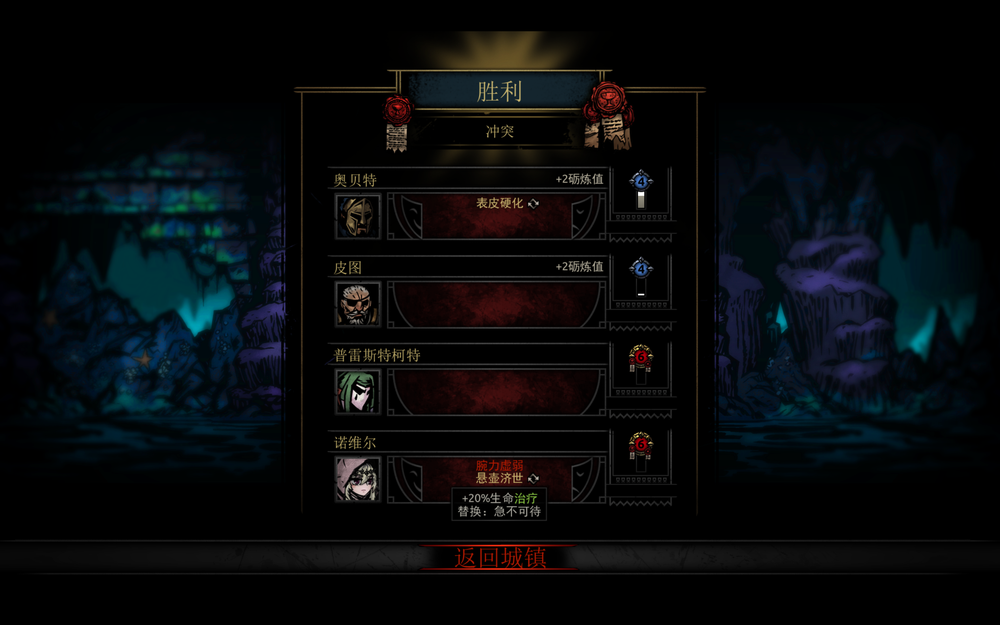

# Darkest Dungeon Docs

> 悬壶济世修女！！！

## 怪癖

### 黄癖

#### T0

|  先手权  |           效果           |
| :------: | :----------------------: |
| 反应快速 |         +2 速度          |
| 光芒四射 |     +2 速度 +5 闪避      |
| 快速出鞘 |     第一回合 +4 速度     |
| 警惕戒备 | 第一回合 +4 速度 +5 闪避 |
| 棱镜速度 |         +3 速度          |
|  早起者  |   光亮高于75则 +2 速度   |
|  夜猫子  |   光亮低于26则 +2 速度   |

### 红癖

|    #     |                           旧神祭坛                           |                            告解室                            |                           一堆卷轴                           |                          怪诞的珊瑚                          |
| :------: | :----------------------------------------------------------: | :----------------------------------------------------------: | :----------------------------------------------------------: | :----------------------------------------------------------: |
|          |  |  |  |  |
|   地点   |                            全地牢                            |                             遗迹                             |                             兽窟                             |                             海湾                             |
| 互动方式 |                             圣水                             |                       手摸(25% 消红癖)                       |                             火把                             |                             药草                             |

## 疾病

## 英雄

## 组队思路

