# Darkest Dungeon Docs

## 怪癖

[暗黑地牢新手指引：怪癖与疾病](https://www.bilibili.com/video/BV1XT411W7vE)

### 黄癖

#### T0

可以无脑锁定的黄癖

|  先手权  |           效果           |
| :------: | :----------------------: |
| 反应快速 |         +2 速度          |
| 光芒四射 |     +2 速度 +5 闪避      |
| 快速出鞘 |     第一回合 +4 速度     |
| 警惕戒备 | 第一回合 +4 速度 +5 闪避 |
| 棱镜速度 |         +3 速度          |
|  早起者  |  光亮高于 75 则 +2 速度  |
|  夜猫子  |  光亮低于 26 则 +2 速度  |

|  精准类  |                效果                 |
| :------: | :---------------------------------: |
| 急不可待 | 第一回合 +25% 伤害 +20 精准 +5%暴击 |
| 挥舞自然 |               +5 精准               |
| 自然之眼 |             +5 远程精准             |
| 乌鸦之眼 |          +8 精准 +8% 侦查           |
| 棱镜之眼 |               +8 精准               |

> 精准有非常多的通用饰品或专属饰品可以代替，但是好用的速度饰品却非常少

| 伤害与暴击 |           效果           |
| :--------: | :----------------------: |
|    致命    |         +2% 暴击         |
|  棱镜准度  |         +4% 暴击         |
|  精准打击  |       +5% 近战暴击       |
|  锐利鹰眼  |       +5% 远程暴击       |
|  棱镜力量  |        +15% 伤害         |
|   重击者   |      +10% 近战伤害       |
|  正中靶心  |      +10% 远程伤害       |
|  光明战士  | 光亮高于 75 则 +10% 伤害 |
|   潜伏者   | 光亮低于 26 则 +10% 伤害 |

#### T1

有较高的强度，但是需要根据不同的英雄情况来锁定

|   黄癖   |                    效果                     | 描述                                               |
| :------: | :-----------------------------------------: | -------------------------------------------------- |
|   自然   | 不戴饰品 +20% 血量上限 +20% 血量治疗 +3速度 | 仅用于前期，不需要锁，但是前期强度不错             |
| 晴天战士 |          血量高于 99% 则 +20%伤害           |                                                    |
| 暮光之梦 |                  无视潜行                   | 精英本特别有用，最好出在带控制的英雄身上 瘟疫 |

| 仇恨与克星类 |            效果            |
| :----------: | :------------------------: |
|   仇恨异魔   | 对异魔 +15% 伤害 -15% 压力 |
|   仇恨邪秽   | 对邪秽 +15% 伤害 -15% 压力 |
|   仇恨人类   | 对人类 +15% 伤害 -15% 压力 |
|   仇恨野兽   | 对野兽 +15% 伤害 -15% 压力 |
|   异魔克星   | 对异魔 +10% 精准 +5% 暴击  |
|   邪秽克星   | 对邪秽 +10% 精准 +5% 暴击  |
|   人类克星   | 对人类 +10% 精准 +5% 暴击  |
|   野兽克星   | 对野兽 +10% 精准 +5% 暴击  |

最有用的是**异魔克星**，因为DD本大多为异魔，而且后期怪物高闪避，精准和暴击的收益比较高。

|  生存类  |           效果           |
| :------: | :----------------------: |
|   坚韧   |      +10% 血量上限       |
| 表皮硬化 |        +10% 防御         |
|   喜光   | 光亮高于 75 则 -20% 压力 |
| 棱镜镇定 |        -30% 压力         |

#### T2 & T3 TODO

### 红癖

#### 红癖消除

|          |                   旧神祭坛                    |                  告解室                   |                  一堆卷轴                   |                  怪诞的珊瑚                   |
| :------: | :-------------------------------------------: | :---------------------------------------: | :-----------------------------------------: | :-------------------------------------------: |
|          | 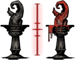 | 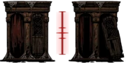 |  | 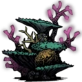 |
|   地点   |                    全地牢                     |                   遗迹                    |                    兽窟                     |                     海湾                      |
| 互动方式 |                     圣水                      |             手摸(25% 消红癖)              |                    火把                     |                     药草                      |

## 疾病

消，全都给我消了，反正很便宜。

## 英雄

- [暗黑地牢新手指引：各英雄浅析（上）](https://www.bilibili.com/video/BV13h411E7x1)
- [暗黑地牢新手指引：各英雄浅析（下）](https://www.bilibili.com/video/BV1Kh4y1n7LQ)

### 十字军/大当家

定位：前排、全能辅助

擅长副本：遗迹

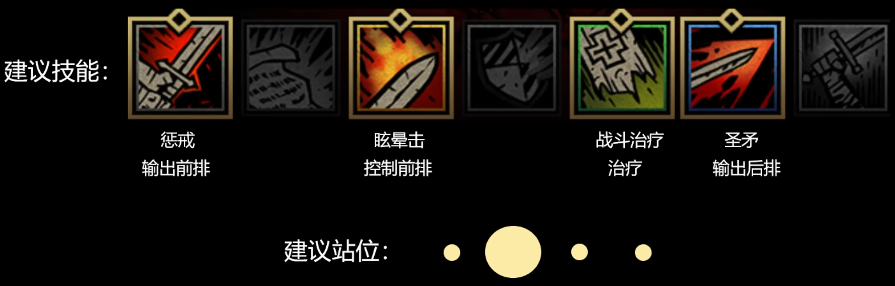

黄癖：急不可待、邪秽克星、仇恨邪秽、遗迹战术家、重击者、精准打击、棱镜准度、棱镜力量、光明战士、潜伏者、致命、乌鸦之眼

擅长副本：遗迹

一般先站在三号位，圣矛戳死敌方后排，圣矛还可以防乱位。

缺点：太慢了，满级速度只有 3。所以黄癖建议放弃速度。

遗迹杀手：急不可待、邪秽克星、仇恨邪秽、遗迹战术家等定向输出黄癖，专攻遗迹，一矛一条命，动如雷霆。

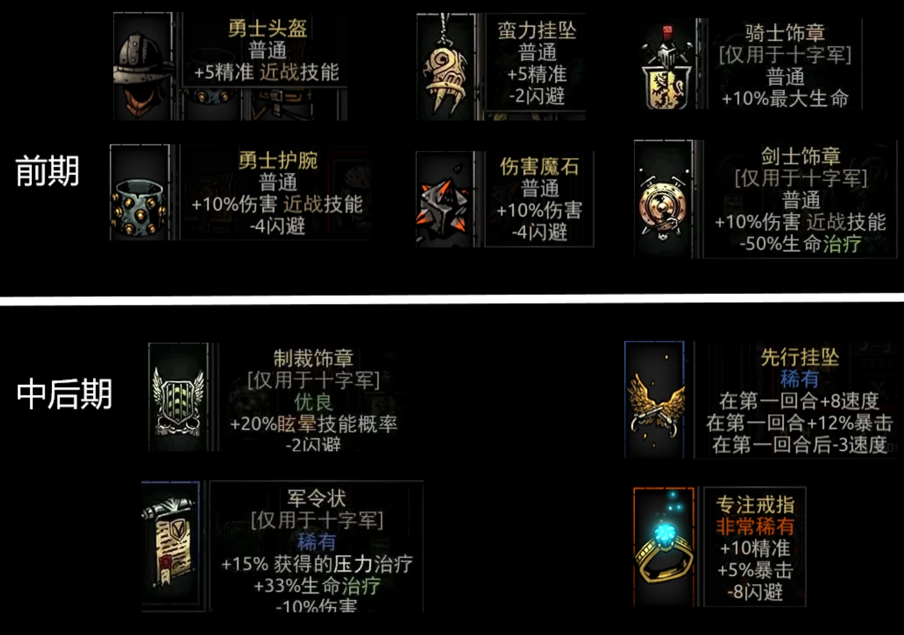

### 强盗/二当家

定位：C位置输出

自身可以站四个位置，完全不怕乱位，攻击范围可以覆盖地方四个位置。无论前后期，二当家都有不俗的表现。

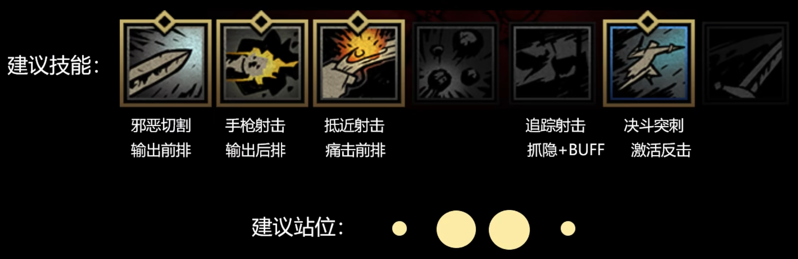

站二号位或三号位，突刺上来后承受伤害触发反击，从而形成一回合内的多端输出。

抵近射击重创前排后，退回到后排，再次衔接决斗突刺，如此反复横跳。

二当家以决斗突刺为主的近战流是最常用的打法。

收益：速度、精准、暴击，近战伤害

黄癖：快速反应、快速出鞘、警惕戒备、早起者、夜猫子、光芒四射、棱镜速度、急不可待、挥舞自然、重击者、精准打击、光明战士、潜伏者、致命、乌鸦之眼

擅长副本：不限

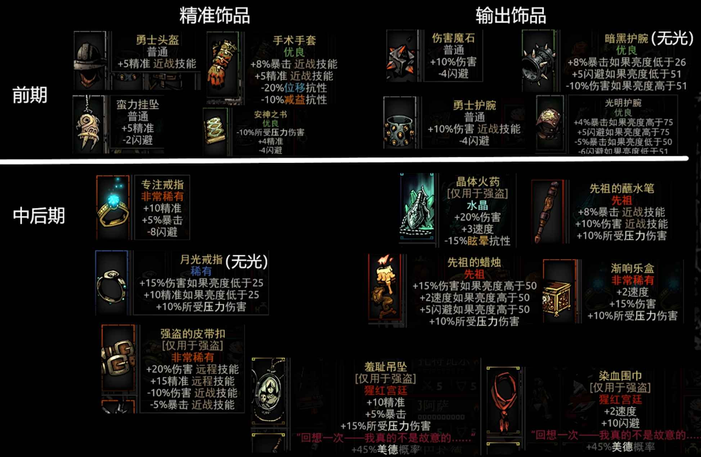

### 瘟疫

定位：主控、辅助输出、辅助治疗

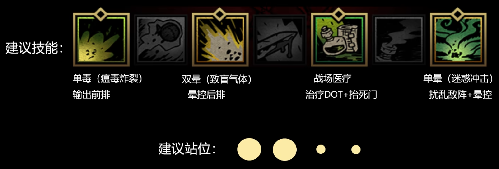

起手双晕控制地方后排，最好搭配**暮光之梦**，无视地方隐身。或者单晕将地方后排炸到前排。毒用来对付高护甲敌人。

收益：速度！！！主要职责是控制，然后是精准保证命中，再加生存。

黄癖：快速反应、光芒四射、快速出鞘、警惕戒备、棱镜速度、早起者、夜猫子、挥舞自然、自然之眼、急不可待、暮光之梦、表皮硬化、坚韧、乌鸦之眼

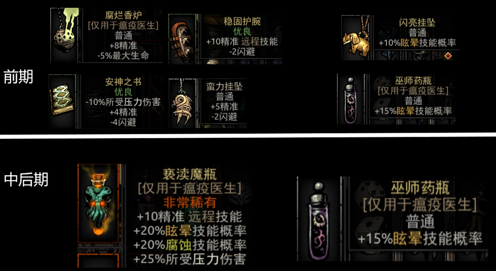

### 修女/奶妈

定位：治疗、辅助输出、辅助控制

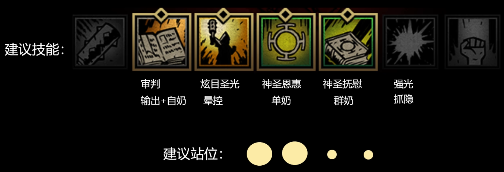

主要负责奶，后期修女没有合适的加眩晕概率的职业饰品，通用饰品加眩晕概率的又性价比太低。因此可以把晕控换成抓隐。

黄癖：悬壶济世、表皮硬化、坚韧、千杯不醉

悬壶济世！！！修女最强黄癖，可遇不可求。

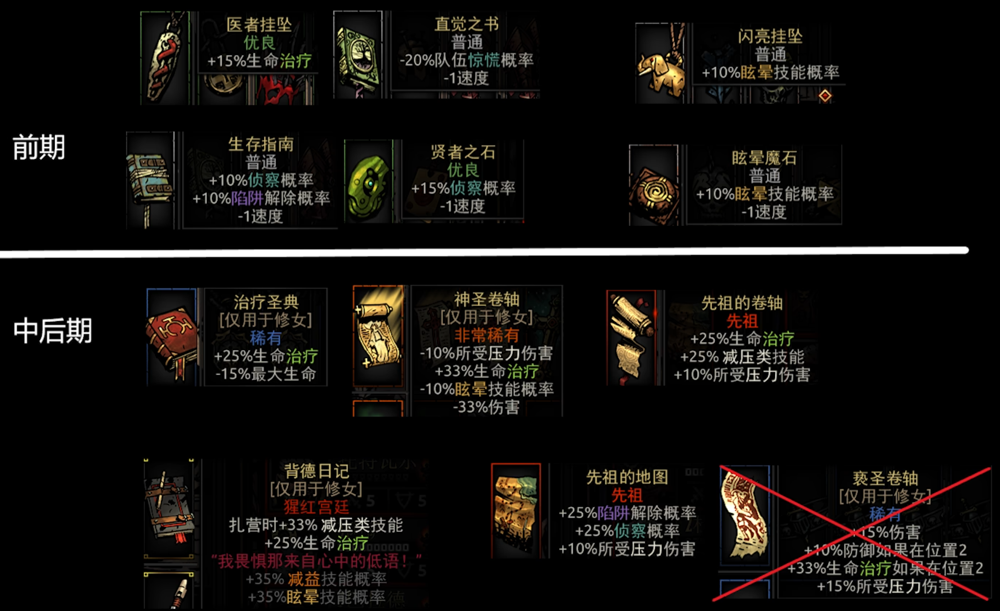

### 赏金

定位：输出、控制

后期只能做输出，但是输出一般

赏金是非常灵活的角色，技能需要根据定位来变更

**输出技能**

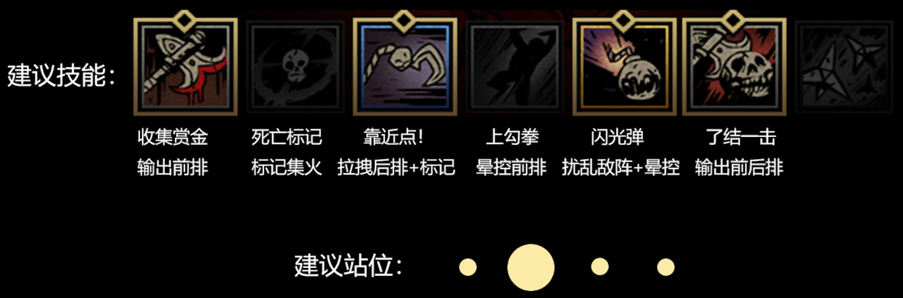

可以搭配一个响应标记的英雄，狗哥、驽手、强盗，把敌人四号位拉到前排集火。

**控制技能**

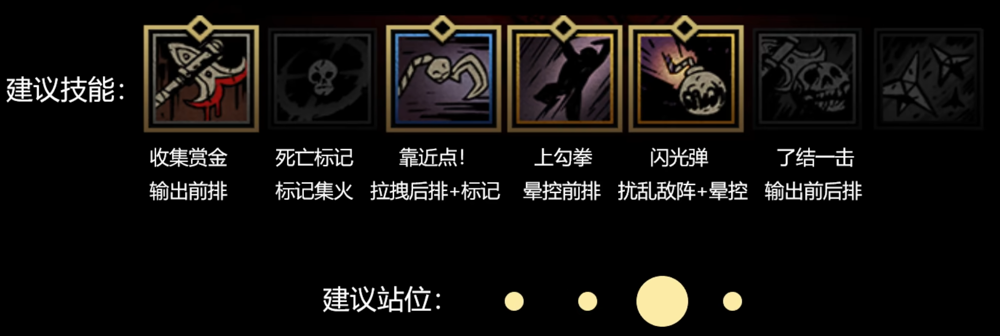

收益：速度、精准、近战暴击、伤害

黄癖：快速反应、光芒四射、快速出鞘、警惕戒备、早起者、夜猫子、棱镜速度、挥舞自然、急不可待、人类克星、仇恨人类、重击者、精准打击、致命、棱镜力量、棱镜准度、光明战士、潜伏者、乌鸦之眼

擅长副本：遗迹、兽窟、门前恶狼、DD4

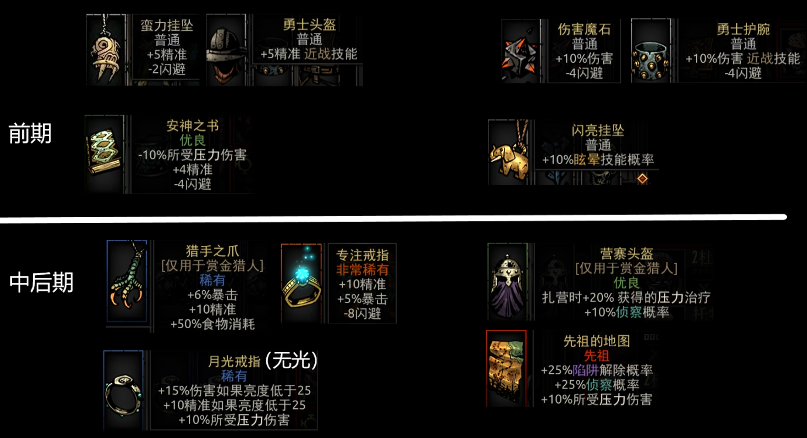

### 盗墓

### 蛮女/恶女

### 麻风/国王

### 老兵

### 神秘学者/三哥

### 小丑

### 火枪手/驽手

### 咒缚者/狼人

### 训犬师/狗哥

### 苦修

### 破盾

### 古董商人

## 配队

### 配队思路

### 推荐配队

## 副本&BOSS

## 互动提示

### 全地牢

### 遗迹

### 兽窟

### 荒野

### 海湾

### 猩红庭院

## 写在最后

> 悬壶济世修女！！！

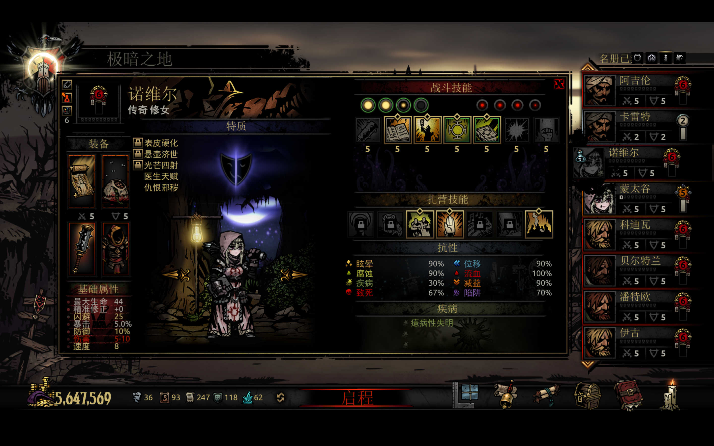
