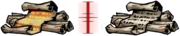
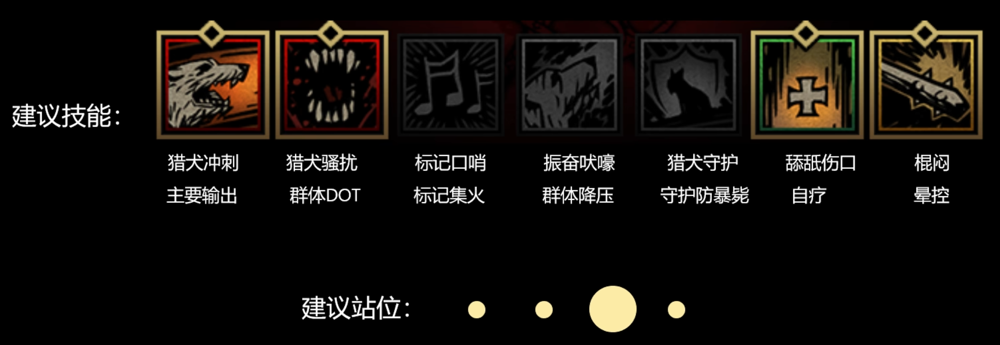
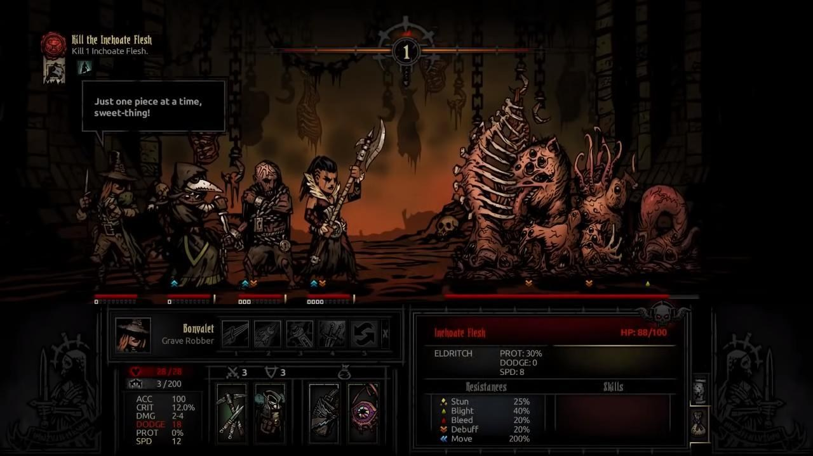

# Darkest Dungeon Docs

## 怪癖

[暗黑地牢新手指引：怪癖与疾病](https://www.bilibili.com/video/BV1XT411W7vE)

### 黄癖

#### T0

可以无脑锁定的黄癖

|  先手权  |           效果           |
| :------: | :----------------------: |
| 反应快速 |         +2 速度          |
| 光芒四射 |     +2 速度 +5 闪避      |
| 快速出鞘 |     第一回合 +4 速度     |
| 警惕戒备 | 第一回合 +4 速度 +5 闪避 |
| 棱镜速度 |         +3 速度          |
|  早起者  |  光亮高于 75 则 +2 速度  |
|  夜猫子  |  光亮低于 26 则 +2 速度  |

|  精准类  |                效果                 |
| :------: | :---------------------------------: |
| 急不可待 | 第一回合 +25% 伤害 +20 精准 +5%暴击 |
| 挥舞自然 |               +5 精准               |
| 自然之眼 |             +5 远程精准             |
| 乌鸦之眼 |          +8 精准 +8% 侦查           |
| 棱镜之眼 |               +8 精准               |

> 精准有非常多的通用饰品或专属饰品可以代替，但是好用的速度饰品却非常少

| 伤害与暴击 |           效果           |
| :--------: | :----------------------: |
|    致命    |         +2% 暴击         |
|  棱镜准度  |         +4% 暴击         |
|  精准打击  |       +5% 近战暴击       |
|  锐利鹰眼  |       +5% 远程暴击       |
|  棱镜力量  |        +15% 伤害         |
|   重击者   |      +10% 近战伤害       |
|  正中靶心  |      +10% 远程伤害       |
|  光明战士  | 光亮高于 75 则 +10% 伤害 |
|   潜伏者   | 光亮低于 26 则 +10% 伤害 |

#### T1

有较高的强度，但是需要根据不同的英雄情况来锁定

|   黄癖   |                    效果                     | 描述                                               |
| :------: | :-----------------------------------------: | -------------------------------------------------- |
|   自然   | 不戴饰品 +20% 血量上限 +20% 血量治疗 +3速度 | 仅用于前期，不需要锁，但是前期强度不错             |
| 晴天战士 |          血量高于 99% 则 +20%伤害           |                                                    |
| 暮光之梦 |                  无视潜行                   | 精英本特别有用，最好出在带控制的英雄身上 瘟疫 |

| 仇恨与克星类 |            效果            |
| :----------: | :------------------------: |
|   仇恨异魔   | 对异魔 +15% 伤害 -15% 压力 |
|   仇恨邪秽   | 对邪秽 +15% 伤害 -15% 压力 |
|   仇恨人类   | 对人类 +15% 伤害 -15% 压力 |
|   仇恨野兽   | 对野兽 +15% 伤害 -15% 压力 |
|   异魔克星   | 对异魔 +10% 精准 +5% 暴击  |
|   邪秽克星   | 对邪秽 +10% 精准 +5% 暴击  |
|   人类克星   | 对人类 +10% 精准 +5% 暴击  |
|   野兽克星   | 对野兽 +10% 精准 +5% 暴击  |

最有用的是**异魔克星**，因为DD本大多为异魔，而且后期怪物高闪避，精准和暴击的收益比较高。

|  生存类  |           效果           |
| :------: | :----------------------: |
|   坚韧   |      +10% 血量上限       |
| 表皮硬化 |        +10% 防御         |
|   喜光   | 光亮高于 75 则 -20% 压力 |
| 棱镜镇定 |        -30% 压力         |

#### T2 & T3 TODO

### 红癖

#### 红癖消除

|          |                   旧神祭坛                    |                  告解室                   |                  一堆卷轴                   |                  怪诞的珊瑚                   |
| :------: | :-------------------------------------------: | :---------------------------------------: | :-----------------------------------------: | :-------------------------------------------: |
|          |  |  |  |  |
|   地点   |                    全地牢                     |                   遗迹                    |                    兽窟                     |                     海湾                      |
| 互动方式 |                     圣水                      |             手摸(25% 消红癖)              |                    火把                     |                     药草                      |

## 疾病

消，全都给我消了，反正很便宜。

## 英雄

- [暗黑地牢新手指引：各英雄浅析（上）](https://www.bilibili.com/video/BV13h411E7x1)
- [暗黑地牢新手指引：各英雄浅析（下）](https://www.bilibili.com/video/BV1Kh4y1n7LQ)

### 十字军/大当家

定位：前排、全能辅助

擅长副本：遗迹

黄癖：急不可待、邪秽克星、仇恨邪秽、遗迹战术家、重击者、精准打击、棱镜准度、棱镜力量、光明战士、潜伏者、致命、乌鸦之眼

擅长副本：遗迹

一般先站在三号位，圣矛戳死敌方后排，圣矛还可以防乱位。

缺点：太慢了，满级速度只有 3。所以黄癖建议放弃速度。

遗迹杀手：急不可待、邪秽克星、仇恨邪秽、遗迹战术家等定向输出黄癖，专攻遗迹，一矛一条命，动如雷霆。

### 强盗/二当家

定位：C位置输出

自身可以站四个位置，完全不怕乱位，攻击范围可以覆盖地方四个位置。无论前后期，二当家都有不俗的表现。

站二号位或三号位，突刺上来后承受伤害触发反击，从而形成一回合内的多端输出。

抵近射击重创前排后，退回到后排，再次衔接决斗突刺，如此反复横跳。

二当家以决斗突刺为主的近战流是最常用的打法。

收益：速度、精准、暴击，近战伤害

黄癖：快速反应、快速出鞘、警惕戒备、早起者、夜猫子、光芒四射、棱镜速度、急不可待、挥舞自然、重击者、精准打击、光明战士、潜伏者、致命、乌鸦之眼

擅长副本：不限

### 瘟疫

定位：主控、辅助输出、辅助治疗

起手双晕控制地方后排，最好搭配**暮光之梦**，无视地方隐身。或者单晕将地方后排炸到前排。毒用来对付高护甲敌人。

收益：速度！！！主要职责是控制，然后是精准保证命中，再加生存。

黄癖：快速反应、光芒四射、快速出鞘、警惕戒备、棱镜速度、早起者、夜猫子、挥舞自然、自然之眼、急不可待、暮光之梦、表皮硬化、坚韧、乌鸦之眼

### 修女/奶妈

定位：治疗、辅助输出、辅助控制

主要负责奶，后期修女没有合适的加眩晕概率的职业饰品，通用饰品加眩晕概率的又性价比太低。因此可以把晕控换成抓隐。

黄癖：悬壶济世、表皮硬化、坚韧、千杯不醉

悬壶济世！！！修女最强黄癖，可遇不可求。

### 赏金

定位：输出、控制

后期只能做输出，但是输出一般

赏金是非常灵活的角色，技能需要根据定位来变更

**输出技能**

可以搭配一个响应标记的英雄，狗哥、驽手、强盗，把敌人四号位拉到前排集火。

**控制技能**

收益：速度、精准、近战暴击、伤害

黄癖：快速反应、光芒四射、快速出鞘、警惕戒备、早起者、夜猫子、棱镜速度、挥舞自然、急不可待、人类克星、仇恨人类、重击者、精准打击、致命、棱镜力量、棱镜准度、光明战士、潜伏者、乌鸦之眼

擅长副本：遗迹、兽窟、门前恶狼、DD4

### 盗墓

定位：C位输出

盗墓是速度最快的输出英雄，没有之一，不需要速度黄癖

收益：精准、暴击、伤害

黄癖：急不可待、重击者、精准打击、乌鸦之眼、挥舞自然、致命、棱镜准度、棱镜力量、光明战士、潜伏者、晴天战士

### 蛮女/恶女

定位：C位输出、暴力前排

前面三个技能已经完全覆盖了敌方四个位置，突破用来防止乱位。

钢铁天鹅挑死敌方四号位是最大的价值。

收益：速度、精准、暴击、近战伤害

黄癖：快速反应、快速出鞘、警惕戒备、早起者、夜猫子、光芒四射、棱镜速度、急不可待、挥舞自然、重击者、精准打击、光明战士、潜伏者、致命、乌鸦之眼、异魔克星

擅长副本：不限，DD3优势英雄

要大DD3最好有个异魔克星，有效防止攻击DD3白细胞被闪避

因为**地狱发髻**，蛮子可以位列无光强势英雄之一

### 麻风/国王

定位：前排、BOSS克星

两套打法，打小怪和打BOSS

麻风伤害特别高，但精准是个大问题，吃站位还手短 + 腿短，乱位到后排就是废物。

**处理小怪**

**打BOSS**

收益：精准、速度、暴击、近战伤害

黄癖：挥舞自然、棱镜之眼、乌鸦之眼、急不可待、快速反应、光慢四射、早起者、夜猫子、重击者、棱镜力量、光明战士、潜伏者、致命、棱镜速度、精准打击

擅长副本：遗迹死灵法师、先知、兽窟血肉、海湾溺亡船员、荒野大炮、门前恶狼、DD4老祖

### 老兵

定位：前排辅助、控制、守护、团队BUFF

老兵速度不快，也没什么伤害，感觉弱，是因为高光学徒，致命伤害不多，精英本也还好，战斗血线压力不高。

但是在冠军本、无光本，小心暴毙。

保护、预防脆皮、被标记的队友受到集火。

收益：速度、精准、生存

黄癖：快速反应、光芒四射、快速出鞘、警惕戒备、早起者、夜猫子、挥舞自然、棱镜之眼、乌鸦之眼、棱镜准度、致命、精准打击、异魔克星、表皮硬化、坚韧、天才、镇定、喜光、棱镜镇定、千杯不醉

擅长副本：DD2 必选，建议培养至少两个

### 神秘学者/三哥

定位：主控、辅助治疗、辅助输出

三个有两套技能，一套输出，一套辅助

**辅助技能**

标记可以换恶魔牵引

三哥并不是纯奶， 深渊之手有很高的眩晕概率，容易实现二连晕。三哥搭配的阵容要形成强大的控制能力。

**输出技能**

自带异魔加成，适合海湾和荒野，以及DD

非主流，三哥还是以辅助为主

收益：速度、精准、暴击、伤害

黄癖：快速反应、光芒四射、快速出鞘、警惕戒备、早起者、夜猫子、棱镜速度、棱镜之眼、挥舞自然、自然之眼、急不可待、暮光之梦、致命、锐利鹰眼、表皮硬化、乌鸦之眼、棱镜准度、异魔克星、仇恨异魔

有异魔克星那更好，打DD本优势巨大

擅长副本：海湾、荒野、DD1、DD2、DD3

### 小丑

定位：减压、辅助输出、团队BUFF

战歌BUFF可以叠加

谢幕是小丑的核心输出技能，小丑所有的技能都对谢幕有伤害增幅。一般用于收尾斩杀。

收益：速度上BUFF、堆闪避保证生存

黄癖：快速反应、光芒四射、快速出鞘、警惕戒备、早起者、夜猫子、棱镜速度、精准打击、致命、急不可待、挥舞自然、棱镜之眼、表皮硬化、重击者、光明战士、潜伏者、乌鸦之眼、灵活

擅长副本：不限、DD1、DD4

### 火枪手/驽手

同一个角色，换皮而已

定位：C位输出、辅助治疗

理论上是响应标记伤害最高的，但是实战非常僵硬，速度慢、怕乱位。不适合做主力。

黄癖：快速反应、光芒四射、快速出鞘、警惕戒备、早起者、夜猫子、棱镜速度、棱镜之眼、挥舞自然、自然之眼、急不可待、正中靶心、致命、锐利鹰眼、表皮硬化、乌鸦之眼、棱镜准度、悬壶济世

### 咒缚者/狼人

定位：主控、辅助输出

常用技能就两个，甩链子和跪下。

定位就是主控，变身只是应急。

收益：速度、精准、暴击，暴击可以增加 20% 眩晕概率

黄癖：快速反应、光芒四射、快速出鞘、警惕戒备、早起者、夜猫子、棱镜速度、乌鸦之眼、挥舞自然、自然之眼、急不可待、锐利鹰眼、致命、棱镜准度、异魔克星、喜光、镇定、棱镜镇定、暮光之梦

擅长副本：不限、DD3优势英雄

### 训犬师/狗哥

定位：C位输出、辅助减压、辅助控制、辅助守护

**前期技能**

**后期技能**

组好配合上标记的英雄，三个和赏金都可以

守护只是应急，狗哥身板并不硬

收益：速度、精准、暴击、远程伤害

黄癖：快速反应、光芒四射、快速出鞘、警惕戒备、早起者、夜猫子、棱镜速度、乌鸦之眼、挥舞自然、自然之眼、急不可待、正中靶心、锐利鹰眼、致命、光明战士、潜伏者、棱镜准度、棱镜力量、野兽克星、仇恨野兽

擅长副本：兽窟、荒野、DD2、DD3

### 苦修

定位：前排、治疗、输出、辅助减压

机制很特殊，需要吃伤害降低血线，主要靠DOT伤害，攻击面板比较低

一套输出，一套辅助

**输出技能**

**辅助技能**

伤痛之雨可以换忍耐、受难

苦修的治疗思路是服务于进攻向的

苦修没有美德，只有折磨(狂喜)，会增加自身的伤害，但是有概率抽队友。

苦修在血量低于 40% 后，+20% 伤害 +7% 暴击

死门群奶队友，死亡有概率眩晕地方和奶队友

收益：速度、精准、暴击、生存，伤害不重要，靠DOT打伤害，暴击可以增加DOT至5回合

黄癖：快速反应、光芒四射、快速出鞘、警惕戒备、早起者、夜猫子、棱镜速度、棱镜之眼、挥舞自然、乌鸦之眼、精准打击、悬壶济世、致命、表皮硬化、天才、喜光、镇定、棱镜镇定、坚韧、异魔克星、富血、棱镜凝固、绝境击杀、倔强不屈

擅长副本：兽窟、荒野、门前恶狼、海湾

### 破盾

定位：C位输出

前期伤害不足，扎透只有 0.9 伤害修正

蛇梦：破盾特殊夜袭，放不住

收益：速度、精准、暴击、近战伤害

黄癖：快速反应、光芒四射、快速出鞘、警惕戒备、早起者、夜猫子、棱镜速度、急不可待、挥舞自然、重击者、精准打击、光明战士、潜伏者、致命、乌鸦之眼、棱镜之眼、棱镜准度、棱镜力量、表皮硬化、坚韧

擅长副本：不限、CC本花园宝宝与无尽农场的优势英雄

### 古董商人

定位：赚钱工具人...

副本中所有战利品相关的互动让古董进行交互，会额外摸出小古董和大古董。

尽量去中本，小本东西太少，大本东西装不下。

古董技能不是很重要。

建议组队

工具人带侦查视频就可以了。

## 配队

### 配队思路

### 推荐配队

## 副本&BOSS

### 未成之血肉

特性:高伤，治愈，晕眩，多形态，共用血量

属性:异魔

回合行动点:4（每个个体1行动点）

技能：

- 骨椎劲扫:对任意单体英雄造成中额伤害同时概率眩晕
- 畸变突袭:对后排单体或两位英雄造成中额伤害同时概率腐蚀
- 生吞活剥:对前排单体或两位英雄造成巨额伤害
- 鲜血涌动:为自身回复一定血量

他的特点就是多动，全能。dot，高伤，回血，防御它全都有，不过好在它的眩晕抗性并不高，流血腐蚀抗性也不高，所以靠上dot，眩晕把它耗死是最佳的办法。

瘟疫的双毒，苦修的双流血，狗哥的全体流血都是不错的上dot技能。只要把dot上了，接下来就是时间问题了

### 巫婆

特性:禁锢，回血

属性:人类

回合行动点:2

技能：

- 请君入瓮:随机将一位英雄拉入锅中，锅中角色无法行动且双方每行动一次都会按百分比掉血，濒死自动出锅
- 尝尝鲜炖:对任意单体英雄造成小额伤害与中幅压力，同时给自身回血
- 调味至美:对任意单体英雄造成小额伤害与中幅压力，同时概率减精准减暴击
- 松筋嫩肉:对全体英雄造成低额伤害

打巫婆很简单，纯纯的火力碾压就行。

由于大锅适中的血量，一回合往往需要两名输出角色将其破坏而耽误了输出机会。

最佳的方法就是无视入锅队友争取闪击巫婆

## 互动提示

### 全地牢

### 遗迹

### 兽窟

### 荒野

### 海湾

### 猩红庭院

## 写在最后

> 悬壶济世修女！！！

